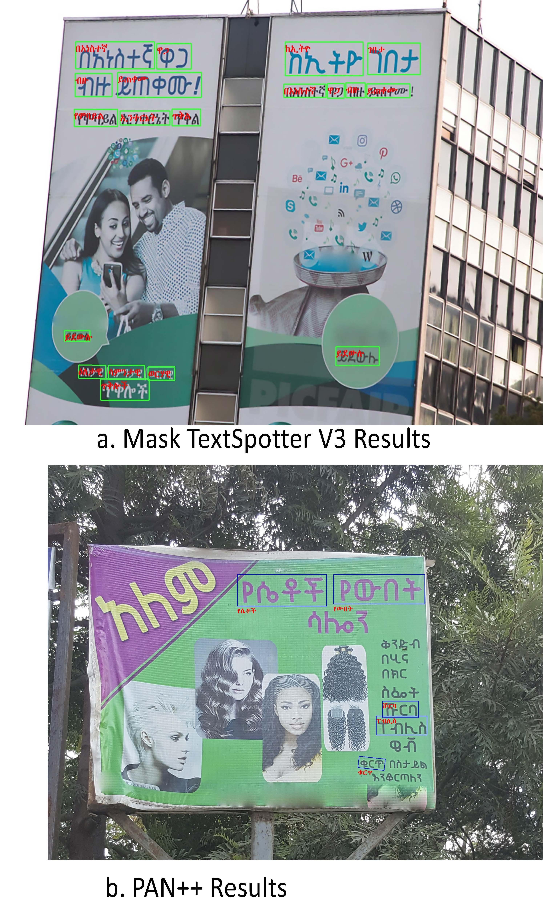

# Comprehensive Benchmark Datasets for Amharic Scene Text Detection and Recognition

In this work, we presented four datasets named HUST-ART, HUST-AST, ABE, and Tana for Amharic script detection and recognition in the nature scene. The proposed datasets are the first comprehensive and public Amharic script datasets to the best of our knowledge. These datasets will promote the development of robust Amharic script detection and recognition algorithms. Consequently, the outcome will benefit people in East Africa, including diplomats from several countries and international communities.

For detailed analysis and information, please refer to the supplementary document.
[[Suplementary](images/suplementary.pdf)]
 

<!-- #### Download Datasets:  --> 

#### Download Detection Datasets
HUST-ART [[Baidu](https://pan.baidu.com/s/1qt6zQBITVaZQQucq1lkCJg)], passwd: 8wns or  [[OneDrive](https://1drv.ms/u/s!AgGaEVjXyVXwao_owSrMXIZtVKI?e=14whRb)] 
HUST-AST [[Baidu](https://pan.baidu.com/s/1qt6zQBITVaZQQucq1lkCJg)], passwd: 8wns or  [[OneDrive](https://1drv.ms/u/s!ArX3oeMKNXLsiNApi9yL0QQsrj1XWw?e=Q694xJ)] 

#### Download Recognition Datasets 
HUST-ART [[Baidu](https://pan.baidu.com/s/1w6ZHRHS7e6ZKx1wH2C0I2g)], passwd:k6wj or [[OneDrive](https://1drv.ms/u/s!ArX3oeMKNXLsiNAoRkGfGCmJJiVS0Q?e=AobKsJ)]
ABE [[Baidu](https://pan.baidu.com/s/1w6ZHRHS7e6ZKx1wH2C0I2g)], passwd:k6wj or [[OneDrive](https://1drv.ms/u/s!ArX3oeMKNXLsiNAqlwK4jSVpFCXMKA?e=dRMC74)]
TANA [[Baidu](https://pan.baidu.com/s/1qt6zQBITVaZQQucq1lkCJg)], passwd: 8wns or  [[OneDrive](https://1drv.ms/u/s!AgGaEVjXyVXwao_owSrMXIZtVKI?e=14whRb)] 

## Dataset Highlights

### HUST-ART

The comparisons of HUST-ART and other datasets:

| Dataset      | Language | Text shape | Total images | Cropped words | Total instances | Av. Instances |
| :----------- | :------- | ---------- | :----------- | ------------- | --------------- | ------------- |
| ICDAR-2013   | ENG      | Horizontal | 462          | 1,503         | 1,943           | 4.2           |
| ICDAR-2015   | ENG      | Oriented   | 1500         | 6,545         | 1,1886          | 7.9           |
| MLT17        | ENG/CHN  | Oriented   | 12,514       | 84,868        | 107,537         | 8.6           |
| Total-Text   | ENG      | Cruved     | 1,555        | 9,330         | 11,459          | 6.0           |
| Addis et al. | Amharic  | -          | -            | 2,500         | -               | -             |
| HUST-ART     | Amharic  | Oriented   | 2,200        | 11,254        | 14,069          | 6.4           |

*   The first real world Amharic detection dataset.
*   Contain 2,200 natural scenes images.
*   A total of 11,254 cropped text instances.
*   Comprises diversified scenes, including signboards, posters, indoors, streets, etc.

### HUST-AST
*   The first synthetic  Amharic detection dataset.
*   Contain 75,904 images
*   A total of 829394 cropped synthetic text instances.
*   Various scenes and typeface.

### Visualizations of Detection

### ABE
*   The first real world Amharic recognition dataset.
*   Contain 12,839 real-word text images: 7,621 for training and  5,218 for testing. 
*   Various scenes

### Tana
*   The first diverse and large synthetic Amharic recognition dataset.
*   Consists of 2,851,778 synthetic word images, including the 829394 HUST-AST cropped text images.
*   Various scenes.

### Visualizations of Recognition

### Visualizations of Recognition

## Leaderboard of detection

Results on HUST-ART dataset:

| Method | Backbone | Precision | Recall | F1-measure | FPS  |
| :----- | :------- | :-------- | ------ | ---------- | ---- |
| EAST   | Res50    | 79.67     | 79.10  | 79.38      | -    |
| PSENET | Res50    | 94.79     | 72.21  | 81.97      | -    |
| PAN    | Res18    | 95.21     | 73.52  | 82.97      | 28   |
| DB     | Res18    | 96.61     | 73.67  | 83.60      | 50   |
| DB     | Res50    | 95.31     | 74.62  | 83.71      | 22   |

## Leaderboard of recognition

Results on ABE dataset:

|       Method       |Accuracy (%) |
| :----------- | :---------------- |
| CRNN         | 75.91 			   |
| RARE         | 78.13             |
| ASTER        | 81.4              |
| SATRN        | 85.66             |
| MASTER       | 86.5              |  

Results on HUST-ART dataset:

|       Method       |Accuracy (%)|
| :----------- | :----------------|
| CRNN   	   | 80.26 			  |
| RARE         | 82.05 			  |
| ASTER        | 85.3  			  |
| SATRN        | 87.54 			  |
| MASTER       | 87.7             |

## Leaderboard of End-to-end detection and recognition

| Method               | E2E      | Precision | Recall | F1-measure | 
| :--------------------| :------- | :-------- | ------ | ---------- | 
| PAN++                | 30.31    | 93.38     | 30.06  | 45.48      | 
| Mask TextSpotter v3  | 81.71    | 88.31     | 80.82  | 84.40      | 

E2E refer to the End-to-end recognition accuracy rate.
## Contact
Send an email to myethiopia2025@gmail.com for any queries.

